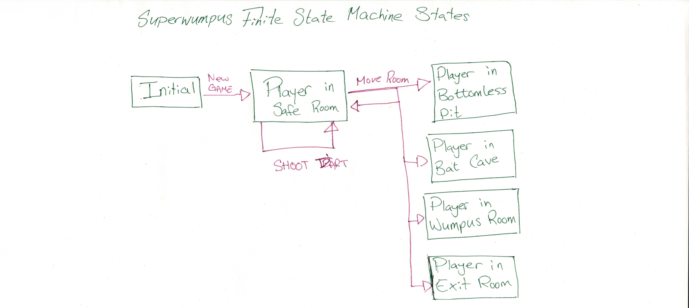
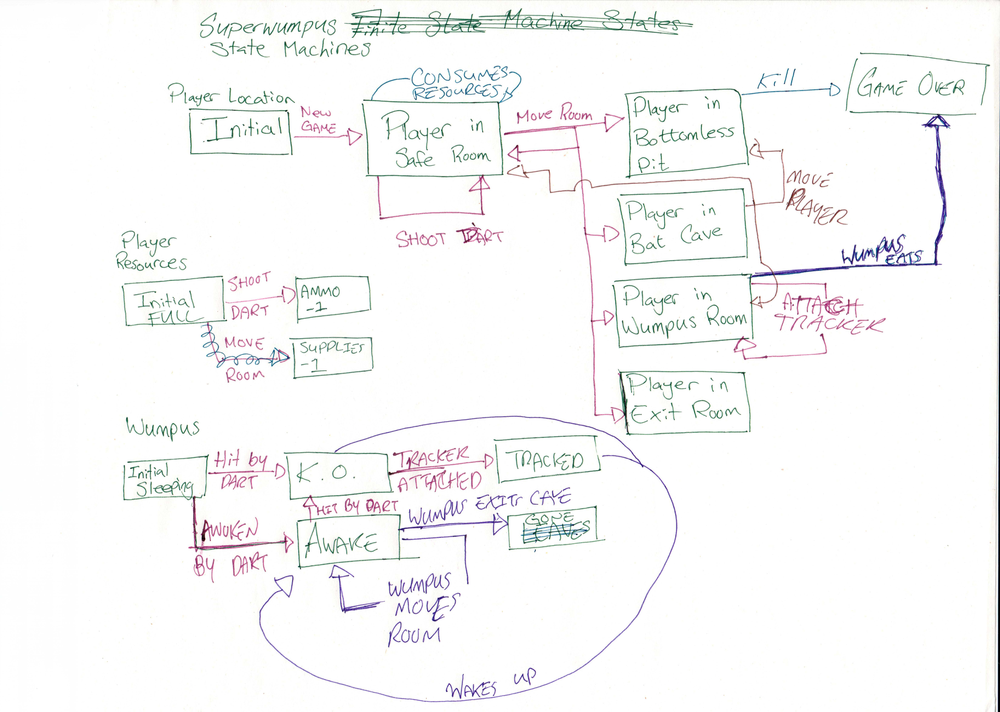

# Chapter 1 - Superwumpus State Machines

The Superwumpus game has a neat and tidy set of states that it can be in, and a Finite State Machine (FSM) is the nice abstraction for us to start thinking about all of the moving parts of our game.

Let's start by replacing the `p` element in our html:

```html
<body>
    <p id="current-state"></p>
</body>
```

We can use that element as a target to show our current state. Let's start by mapping out our possible states. There are two obvious choices to start with:


When we first load the game, we start in the `Initial` state - we haven't actually started playing yet. The player can start a `New Game` which will move us to the `Player in Safe Room State` (we will ensure that we never spawn the player in a bottomless pit). In these diagrams, the green boxes and text are represent states, and the red arrows represent directional transitions between states.

Even in a simple game like Superwumpus, there are a lot of ways that we could map out our FSM. There is a balance between finding the platonic ideal and getting the game done. Whatever method you choose, it probably won't be perfect. And that's okay! For example, it isn't exactly clear how we ought to map out the transitions from the `Safe Room` state. Is moving into a bottomless pit a transition to the endgame directly, or is moving into a room a transition to the bottomless pit room state? It depends on what you want to achieve and how pure you need your FSM to be!

The rule of thumb we will adopt in our game is to lean on having too many states and transitions rather than too few. It'll let us be crystal clear about how the game is flowing through states at the cost of some verbosity. It also implies that we will need to introduce a concept of AI. Not, like, good *Alien: Isolation* AI. Way way way more basic then that: the "game" needs to take turns with the players. If the bottomless pit room is a state, then *someone* needs to make the action of transitioning the player to dead. Additionally, we know the Wumpus (and other non-playables) will also need to take turns.

With all of these players, we should also consider a consistent turn order. As our currently very minimal FSM shows, the player (if possible) will initiate the transition to a new state. So who goes next? This is core game mechanics, and there really is no right answer. Feel free to adjust these knobs to create a different experience. If the Wumpus goes second, it may eat the player before bats can move the player away after a move to a bat cave. For this series, this will be our order:

1. The player
2. The "game"
3. Non-Wumpus
4. Wumpus

I'd like to re-emphasize that this is the order from the perspective of the player. From the perspective of the FSM, the player is actually the last to take a turn: at the start of a state, it runs through the game, non-Wumpus, and Wumpus action takes before allowing the player to take an action.

Let's start by filling in some player actions:



So, most of the actions that the player can take involve navigating the dodecahedron. Which makes a lot of sense for a survival horror game! The `Shoot Dart` action is a special case. The player doesn't move rooms after the shot, but they DO affect the state of the world. We could add each permutation of the state of each entity to our diagram (Player in Safe Room, Ammo 4; Player in Safe Room, Ammo 3; etc...), but it's way cleaner to just add more FSMs that can interact. I'm not sure if academics would still call this mess a FSM, so we'll also go ahead and rename it to the Superwumpus State Machines (SSM).

Adding some state tracking for the Player Resources and the Wumpus, this is what we arrive at:



This is good place to stop our paper SSM. This model is just enough to give us a head start on the things we need to code without getting too deep on the technicalities. I've taken a lot of shortcuts on it: there is no utility of mapping the entire state tree of the possible resource combinations, for instance. That's what the computer is for!

